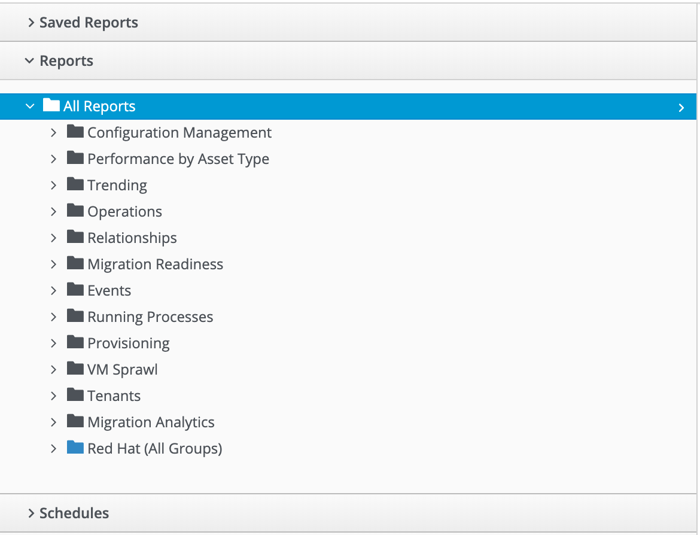

# Out-of-the-box Reports

(see screenshot [Adding an Embedded Method](#i1)).

## Report Categories

There are several out-of-the-box report categories, as follows:

### Configuration Management

The **Configuration Management** folder contains reports for the following categories of object:

#### Virtual Machines

The **Virtual Machines** folder contains the following reports:

##### Account Groups - Linux

##### Account Groups - Windows

##### Guest OS HKLM Registry Information

##### Guest OS Information - any OS

##### Guest OS Information - Linux

##### Guest OS Information - Windows

##### Hardware Information for VMs

##### Orphaned VMs

##### Recently Discovered VMs

##### Unregistered VMs

##### User Accounts - Linux

##### User Accounts - Windows

##### Vendor and Guest OS

##### Vendor and Type

##### VM Disk Usage

##### VM Location and Size

##### VMs by MAC Address

##### VMs Snapshot Summary

##### VMs w/Free Space > 75% by Function

##### VMs w/Free Space > 75% by LOB

##### VMs with Free Space > 50% by Department

##### VMs with no UUID

##### VMs with Volume Free Space <= 20%

##### VMs with Volume Free Space >= 80%

##### VM UUIDs

#### Instances

The **Instances** folder contains the following report:

##### Amazon - Active VMs

#### Clusters

The **Clusters** folder contains the following reports:

##### Cluster Hosts Affinity

##### Cluster Resources

##### Cluster Summary

##### Cluster VMs Affinity with Power State

#### Storage

The **Storage** folder contains the following reports:

##### Datastore LUN Information

##### Datastores Summary

##### Datastore Summary for Hosts

##### Datastore Summary for VMs

#### Hosts

The **Hosts** folder contains the following reports:

##### Date brought under Management for Last Week

##### Hardware Information

##### Host - ESX Service Console Packages

##### Host - ESX Services

##### Host Network Information

##### Host Patches

##### Hosts Summary

##### Host Storage Adapters

##### Host Summary for VMs

##### Host Summary with VM info

##### Host vLANs and vSwitches

##### Host VM Relationships

##### Recently Added Hosts

##### Virtual Infrastructure Platforms

#### VM Folders

The **VM Folders** folder contains the following reports:

##### Folder VMs Relationships

#### Containers

The **Containers** folder contains the following reports:

##### Images by Failed OpenSCAP Rule Results

##### Nodes By Capacity

##### Nodes By CPU Usage

##### Nodes By Memory Usage

##### Nodes by Number of CPU Cores

##### Number of Images per Node

##### Pod Counts For Container Images by Project

##### Pods per Ready Status

##### Projects By CPU Usage

##### Projects By Memory Usage

##### Projects by Number of Containers

##### Projects by Number of Pods

##### Projects by Quota Items

##### Recently Discovered Pods

#### Providers

The **Providers** folder contains the following reports:

##### Monthly Host Count per Provider

##### Monthly VM Count per Provider

##### Providers Host Relationships

##### Providers Summary

##### Providers VMs Relationships

#### Physical Servers

The **Physical Servers** folder contains the following reports:

##### Physical Server Availability

##### Physical Server Health

##### Recently Discovered Physical Servers

#### Resource Pools

The **Resource Pools** folder contains the following report:

##### Resource Pools Summary

### Performance by Asset Type

The **Performance by Asset Type** folder contains reports for the following categories of object:

#### Virtual Machines

The **Virtual Machines** folder contains the following reports:

##### All Departments with Performance

##### Host CPU Usage per VM

##### Top CPU Consumers (weekly)

##### Top Memory Consumers (weekly)

##### Top Storage Consumers

##### VM Performance - daily over the last week

##### VM Resource Utilization

##### VMs with Avg Daily CPU > 85% (past mo.)

##### VMs with Avg Daily Mem < 50% (past mo.)

##### VMs with Avg Daily Mem > 95% (past mo.)

##### VMs with Avg Daily CPU > 85% (past mo.)

##### VMs with Avg Daily Mem > 50% (past mo.)

##### Weekly Utilization Overview

#### Clusters

The **Clusters** folder contains the following report:

##### Cluster Memory and CPU Usage (7 days)

### Trending

The **Trending** report category contains reports

The folder contains reports for the following categories of object:

#### Clusters

The **Clusters** folder contains the following reports:

##### Cluster CPU Trends (last week)

##### Cluster I/O Trends (last week)

##### Cluster memory trend 6 months

##### Cluster Memory Trends (last week)

#### Storage

The **Storage** folder contains the following report:

##### Datastore Capacity Trend over 6 mos.

#### Hosts

The **Hosts** folder contains the following reports:

##### Host CPU Trends (last week)

##### Host I/O Trends (last week)

##### Host Memory Trends (last week)

##### Host Peak CPU Used Trend over 6 mos.

##### Host Peak Memory Used Trends for 6 mos.

### Operations

The **Operations** folder contains reports for the following categories of object:

#### Clusters

The **Clusters** folder contains the following report:

##### Cluster - DRS Migrations

#### EVM

The **EVM** folder contains the following reports:

##### EVM Server Used IDs Never Used

##### EVM Server UserID Usage Report

##### VMs with Consolidate Helper Snapshots

##### VMs with EVM Snapshots

#### Virtual Machines

The **Virtual Machines** folder contains the following reports:

##### Offline VMs Never Scanned

##### Offline VMs with Snapshot

##### Online VMs (Powered On)

##### Registered VMs by Free Space

##### Registered VMs with Free Space <35%

##### Unregistered VMs Free Space <35%

##### VMs not Powered On

##### VMs with old VMware tools

##### VMs without VMware tools

##### VMware Tools Versions

#### Events

The **Events** folder contains the following report:

VC Snapshot Events by User

### Relationships

The **Relationships** folder contains reports for the following categories of object:

#### Virtual Machines, Folders, Clusters

The **Virtual Machines, Folders, Clusters** folder contains the following reports:

##### Cluster Relationships

##### Folder to VMs Relationships

##### VM Relationships

### Migration Readiness

The **Migration Readiness** folder contains reports for the following categories of object:

#### Virtual Machines

The **Virtual Machines** folder contains the following reports:

##### Detailed - VMs migration ready

##### Detailed - VMs NOT migration ready

##### Summary - VMs migration ready

##### Summary - VMs NOT migration ready

### Events

### Running Processes

### Provisioning

### VM Sprawl

### Tenants

