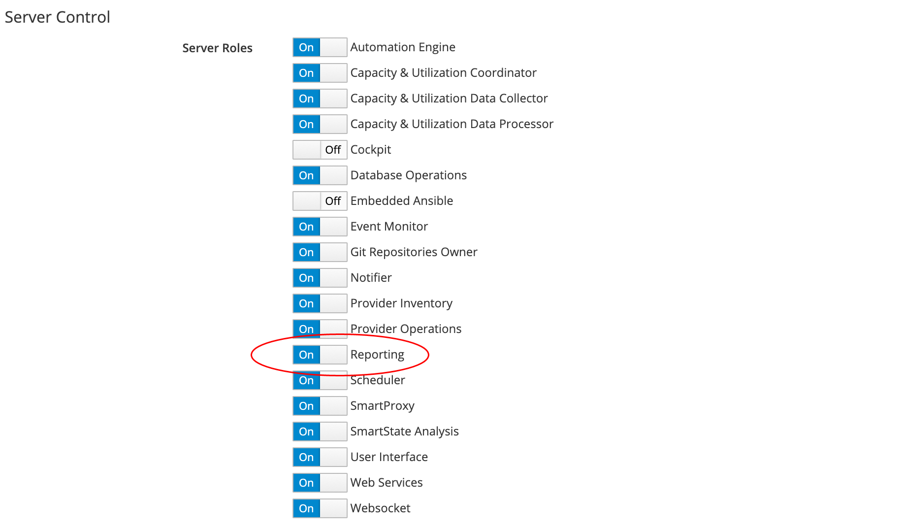

# Introduction to Reports

This book describes the reporting capability of CloudForms and ManageIQ. 

Reports are found under the **Cloud Intel** menu in the WebUI (see screenshot [Reports Menu](#i1)).

To use the reporting capability the **Reporting** server role must be enabled in the Configuration menu (see screenshot [Reporting Server Role](#i2)).

